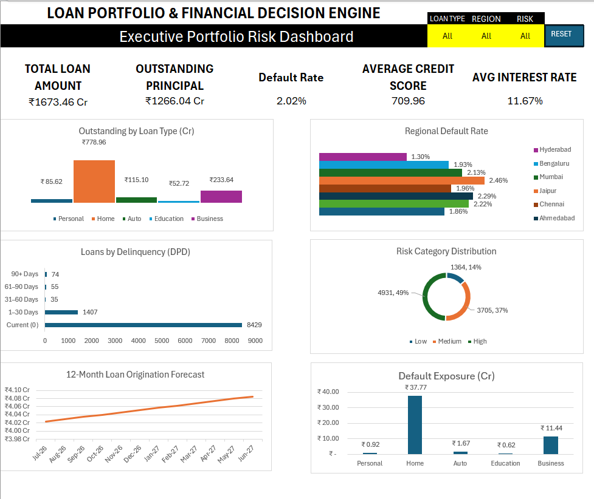

# Loan Portfolio & Financial Decision Engine

> **Advanced Excel \| Banking & Financial Analytics**\
> Interactive Portfolio Analytics • Credit Risk • Financial Modelling •
> Forecasting • Decision Support • VBA Automation

## Project Overview

The **Loan Portfolio & Financial Decision Engine** is an end-to-end
Microsoft Excel analytics project built to simulate how a financial
institution can monitor a lending portfolio, identify credit and
delinquency risk, perform financial modelling, evaluate scenarios,
forecast portfolio activity, and support borrower-level financial
decisions.

The solution analyzes **10,000 synthetic loan records** covering
**2023--2026** and combines portfolio analytics, risk analysis,
financial modelling, forecasting, an interactive executive dashboard,
and VBA-powered automation.

  -----------------------------------------------------------------------
  Item                                Details
  ----------------------------------- -----------------------------------
  Domain                              Banking / BFSI / Financial
                                      Analytics

  Dataset                             10,000 synthetic loan records

  Period                              2023--2026

  Primary Tool                        Microsoft Excel

  Workbook                            Macro-enabled `.xlsm`

  Main Output                         Interactive Executive Dashboard &
                                      Financial Decision Engine

  Automation                          VBA-powered Reset Filters button
  -----------------------------------------------------------------------

## Executive Dashboard



### Dashboard KPIs

-   **Total Loan Amount:** ₹1,673.46 Cr
-   **Outstanding Principal:** ₹1,266.04 Cr
-   **Default Rate:** 2.02%
-   **Average Credit Score:** 709.96
-   **Average Interest Rate:** 11.67%

> Baseline values represent the complete portfolio when all dashboard
> filters are set to `All`.

### Interactive Filters

The dashboard supports dynamic analysis using **Loan Type**, **Region**,
and **Risk Category**. Applicable KPI cards and charts recalculate
automatically when filters change.

A VBA-powered **RESET FILTERS** button restores all three dashboard
filters to `All`.

## Business Problem

Financial institutions need to monitor portfolio exposure, identify
credit and delinquency risk, understand portfolio performance, evaluate
borrower-level loan economics, and support financial decisions.

This project transforms loan-level data into an Excel-based analytical
and decision-support solution covering both portfolio-level management
analysis and borrower-level financial modelling.

## Business Questions Addressed

1.  What is the total loan portfolio and outstanding exposure?
2.  Which loan types contribute the most to the portfolio?
3.  Which regions have the highest loan exposure and delinquency?
4.  How does credit score relate to loan risk?
5.  Which loans or customers represent higher financial risk?
6.  How much interest has been paid and how much remains?
7.  What happens to loan cost when interest rates change?
8.  Should a borrower prepay a loan or continue the existing repayment
    plan?

## Analytical Workflow

``` text
Raw Loan Data
      ↓
Data Cleaning & Validation
      ↓
Loan-Level Financial Calculations
      ↓
Amortization Analysis
      ↓
Portfolio Analysis
      ↓
Credit Risk & Delinquency Analysis
      ↓
Forecasting
      ↓
Scenario Analysis
      ↓
Financial Decision Engine
      ↓
Interactive Executive Dashboard
```

## Dashboard Visualizations

-   Outstanding Principal by Loan Type
-   Regional Default Rate
-   Risk Category Distribution
-   Loans by Delinquency / DPD
-   12-Month Loan Origination Forecast
-   Default Exposure by Loan Type

Some comparison visuals intentionally retain their own comparison
dimension so that meaningful cross-category comparisons remain visible
while other dashboard filters are applied.

## Excel Skills Demonstrated

  -----------------------------------------------------------------------
  Category                            Techniques
  ----------------------------------- -----------------------------------
  Data Preparation                    Excel Tables, structured
                                      references, data validation, data
                                      quality checks, conditional
                                      formatting

  Analytical Functions                SUMIFS, COUNTIFS, AVERAGEIFS,
                                      SUMPRODUCT, IF, IFERROR, XLOOKUP,
                                      FILTER

  Financial Modelling                 PMT, IPMT, PPMT, PV, FV,
                                      amortization

  Risk Analytics                      Default rate, DPD analysis, risk
                                      segmentation, default exposure

  Advanced Analysis                   What-If Analysis, Goal Seek,
                                      Scenario Analysis, forecasting

  Visualization                       KPI cards, dynamic charts,
                                      executive dashboard

  Interactivity                       Dynamic dropdown filters

  Automation                          VBA macro for dashboard filter
                                      reset
  -----------------------------------------------------------------------

## Workbook Structure

  -----------------------------------------------------------------------
  Worksheet                           Purpose
  ----------------------------------- -----------------------------------
  `01_README`                         Project overview, instructions and
                                      workbook navigation

  `02_RAW_DATA`                       Original loan-level dataset

  `03_DATA_CLEANING`                  Data quality checks and validation

  `04_LOAN_CALCULATOR`                EMI and borrower-level loan
                                      calculations

  `05_AMORTIZATION`                   Loan repayment schedule

  `06_PORTFOLIO_ANALYSIS`             Portfolio KPIs and exposure
                                      analysis

  `07_RISK_ANALYSIS`                  Credit risk, default and
                                      delinquency analysis

  `08_FORECASTING`                    Portfolio forecasting

  `09_SCENARIO_ANALYSIS`              Interest-rate and financial what-if
                                      analysis

  `10_DECISION_ENGINE`                Borrower financial decision support

  `11_DASHBOARD`                      Interactive executive portfolio
                                      dashboard
  -----------------------------------------------------------------------

## Repository Structure

``` text
Loan-Portfolio-Financial-Decision-Engine/
│
├── README.md
├── Loan_Portfolio_Financial_Decision_Engine.xlsm
├── .gitignore
│
├── data/
│   └── loan_portfolio_raw.csv
│
├── screenshots/
│   ├── 01_executive_dashboard.png
│   ├── 02_portfolio_analysis.png
│   ├── 03_risk_analysis.png
│   ├── 04_loan_calculator.png
│   ├── 05_amortization.png
│   ├── 06_forecasting.png
│   ├── 07_scenario_analysis.png
│   └── 08_decision_engine.png
│
└── docs/
    └── project_documentation.md
```

## How to Use the Workbook

1.  Download `Loan_Portfolio_Financial_Decision_Engine.xlsm`.
2.  Open it in **Microsoft Excel Desktop**.
3.  Select **Enable Content / Enable Macros** if you want to use the VBA
    Reset Filters functionality.
4.  Open `11_DASHBOARD`.
5.  Use the Loan Type, Region, and Risk Category dropdowns.
6.  Click **RESET FILTERS** to restore the complete portfolio view.

> The workbook can still be reviewed without enabling macros, but the
> VBA-powered Reset Filters button will not operate.

## VBA Automation

``` vb
Sub ResetDashboardFilters()

    Application.ScreenUpdating = False

    With Worksheets("11_DASHBOARD")
        .Range("L3").Value = "All"
        .Range("M3").Value = "All"
        .Range("N3").Value = "All"
    End With

    Application.Calculate
    Application.ScreenUpdating = True

End Sub
```

## Project Documentation

For methodology, workbook architecture, risk logic, financial modelling,
forecasting, dashboard behavior, and VBA implementation, see **[Project
Documentation](docs/project_documentation.md)**.

## Screenshots

  ------------------------------------------------------------------------------------------------
  Portfolio Analysis                                 Risk Analysis
  -------------------------------------------------- ---------------------------------------------
     Analysis](screenshots/03_risk_analysis.png)

  ------------------------------------------------------------------------------------------------

  -----------------------------------------------------------------------------------------------
  Loan Calculator                                   Decision Engine
  ------------------------------------------------- ---------------------------------------------
     Engine](screenshots/08_decision_engine.png)

  -----------------------------------------------------------------------------------------------

## Business Value

This project demonstrates an end-to-end analytical workflow:

**Data → Analysis → Risk Measurement → Financial Modelling → Forecasting
→ Decision Support → Executive Reporting**

It demonstrates how Microsoft Excel can function as an integrated
analytics and financial modelling application rather than only as a
spreadsheet.

## Limitations

-   The dataset is synthetic.
-   Results do not represent the performance of any actual bank or
    financial institution.
-   Forecasts are analytical estimates rather than guaranteed future
    outcomes.
-   The Financial Decision Engine is for analytical demonstration and is
    not financial advice.
-   VBA functionality requires a compatible Microsoft Excel environment
    with macros enabled.

## Data Disclaimer

The dataset is **synthetic and created exclusively for educational,
analytical, and portfolio demonstration purposes**. It contains no real
customer, borrower, bank, or financial institution data.
